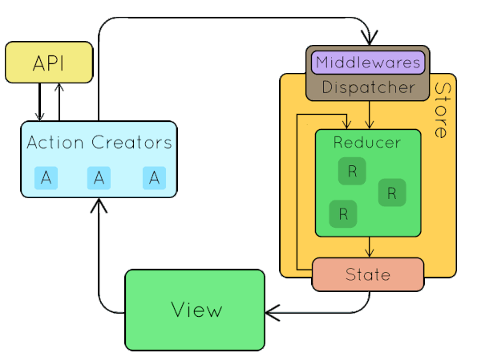

# Core Concepts

Before we begin, let's take a look again at the Redux data flow(*source unknown*):



The bubbles that move around(except state) are all actions. It's not hard to tell that the design of Redux is "action centric". So to reduce boilerplate code the design of Retux is all about reusing action types.

Introducing...

## Action Catalog

```typescript
import { CreateActionCatalog } from 'retux'

type ActionCatalog = CreateActionCatalog<{
  ACTION0: {}
  ACTION1: {
    payload: boolean
  }
  ANOTHER_ACTION: {
    payload: {
      amount: number
    }
    meta: string
  }
}>
```

ActionCatalog defines all the actions of a module. Since it is a basic object type, it can be split and merged which offers great flexibility.

ActionCatalog is the core of Retux. All other facilities are built surrounding ActionCatalog.

It is recommended to prefix Action names with module id. Retux exmaples use `$` as separator as it is easy to be recognized between uppercase characters but you can pick whatever you like.

```typescript
import { CreateActionCatalog } from 'retux'

type ActionCatalog = CreateActionCatalog<{
  MODULE$ACTION0: {}
  MODULE$ACTION1: {
    payload: boolean
  }
  MODULE$ANOTHER_ACTION: {
    payload: {
      amount: number
    }
    meta: string
  }
}>
```

## Action Type

Retux offers `ActionType` for extracting action type names from ActionCatalog. As one may easily figure out, they are just keys of ActionCatalog.

```typescript
import { ActionType } from 'retux'

type ModuleActionTypeNames = ActionType<ActionCatalog>
```

## Action

Here comes the interesting part, how can we extract actions from ActionCatalog?

It is easy to get something like:

```typescript
type Actions = {
  type: 'ACTION1' | 'ACTION2' | ...
  payload: "action1's payload" | "action2's payload" | ...
  meta: "action1's meta" | "action2's meta" | ...
}
```

which is not useful because we want:

```typescript
if (action.type === 'ACTION1') {
  action.payload // -> Will narrow down to ACTION1's payload type
}
```

which means we need:

```typescript
type Actions =
  | {
      type: 'ACTION1'
      payload: "action1's payload"
      meta: "action1's meta"
    }
  | {
      type: 'ACTION2'
      payload: "action2's payload"
      meta: "action2's meta"
    }
  | ...
```

Retux offers `Action` type to deal with just that. It makes use of the "`extend` on union" feature of TypeScript(>= 2.8).

You can choose basic action type `{ type, payload, meta }`

```typescript
import { Action } from 'retux'
// or
import { Action } from 'retux/lib/basic'

type AllActions = Action<ActionCatalog>
type Action1 = Action<ActionCatalog, 'ACTION1'>
```

Or [FSA compliant](https://github.com/redux-utilities/flux-standard-action) action type `{ type, error, payload, meta }`

```typescript
import { FSA } from 'retux'
// or
import { Action } from 'retux/lib/fsa'

type AllActions = Action<ActionCatalog>
type Action1 = Action<ActionCatalog, 'ACTION1'>
```

Note that FSA is also strongly typed. Each action can either be

```javascript
{
  type: // as in ActionCatalog
  error?: false
  payload: // as in ActionCatalog, default none
  meta: // as in ActionCatalog, default none
}
```

or

```javascript
{
  type: // as in ActionCatalog
  error: true
  payload: // as in ActionCatalog, default Error
  meta: // as in ActionCatalog, default none
}
```

## Action Handlers

The default Redux architecture uses `switch` in reducer which is hard for code splitting. In Retux we use simple `object` instead.

```typescript
const counterActionHandlers: ActionHandlers<
  CounterState,
  CounterActionCatalog
> = {
  INCREMENT: (state, { payload }) => ({
    count: state.count + (payload == null ? 1 : payload)
  }),
  DECREMENT: (state, { payload }) => ({
    count: state.count - (payload == null ? 1 : payload)
  })
}
```

Or with FSA:

```typescript
const counterActionHandlers: ActionHandlers<
  CounterState,
  CounterActionCatalog
> = {
  INCREMENT: (state, action) =>
    action.error
      ? state // error handling
      : {
          count: state.count + (action.payload == null ? 1 : action.payload)
        },
  DECREMENT: (state, action) =>
    action.error
      ? state // error handling
      : {
          count: state.count - (action.payload == null ? 1 : action.payload)
        }
}
```

Notice with FSA we do not destructure the `action` argument so that we can separate action types with and without `error`.

Since `ActionHandlers` is strongly typed, any missing or misspelled action handler will fail TypeScript compiling.

You can also get a single Action Handler type with `ActionHandler`. This is useful for defining large Action Handlers outside of `ActionHandlers`.

## Combine Action Handlers

There are patterns in Retux where multiple Action Handlers share the same state. In this case one may want to combine Action Handlers together.

Use `combineUniqueObjects` to combine Action Handlers. It will check duplicated keys statically(yes, type checking duplicated keys) and also throw error on non-production mode.

```typescript
const combinedActionHandlers = combineUniqueObjects(
  actionHandlers1,
  actionHandlers2,
  ...
)
```

If you want to skip checking duplicated keys, use `combineObjects`.

Both of them uses `Object.assign` under the hood but with type enhancement which preserves index signature of the combined Action Handlers. Do not use `Object.assign` directly to join Action Handlers.

Note that there are also `proxyCombineUniqueObjects` and `proxyCombineObjects` which offers same API except everything is lazy loaded and cached with es6 `Proxy`(fallback to `combineUniqueObjects` and `combineObjects` when not supported).

## Create Action Creators

Boilerplate Action Creators are generated by `createActionCreators` in Retux.

```typescript
const action = createActionCreators(actionHandlers)

const action2 = createActionCreators(actionHandlers, {
  // overwrite or extends the generated Action Creators
  INCREMENT: (step: number): StoreActionWithThunk<'INCREMENT'> =>
    dispatch => dispatch({ type: 'INCREMENT', payload: { step } })
})
```

The `actionHandlers` has to be of type `ActionHandlers` so that `createActionCreators` can infer `ActionCatalog` from it and learn the types of all Actions.

Note that `createActionCreators` will actually create N Action Creator functions. Retux also offers `proxyActionCreators` with the same API but lazy create Action Creators on their first visits. It will fallback to `createActionCreators` when es6 `Proxy` is not supported.
