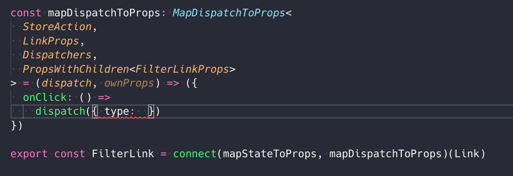
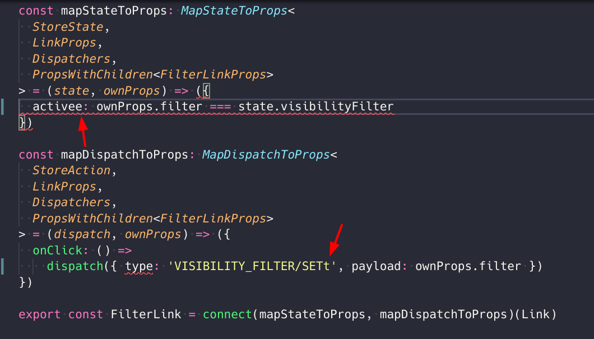

# Retux Todo List Example

This example is based on the Redux [Todo List](https://github.com/reduxjs/redux/blob/master/examples) example.

This project template was built with [Create React App](https://github.com/facebookincubator/create-react-app), which provides a simple way to start React projects with no build configuration needed.

Common questions:

> I don't see any action creator?

Yes! This example shows the ability to reduce boilerplate action creators on small projects with Retux.

TypeScript compiler and intellisense works well on raw Actions.

If you are more comfortable with action creators, Retux also offers a powerful way to generate boilerplate action creators for you. See the docs and the todomvc example.

> Why if I mistype the action type?

All actions in Retux are strongly typed. TypeScript compiler will happily let you know.

> What about changes in the future?

You can either glue the changes in container(where the action is triggered) or in action handler(where the action is handled).

But if you decide to use libraries which mutate action types(like Redux-Thunk and Redux-Promise), it's better to go for action creators.

> Should I get rid of action creators entirly?

No! You can always use action creators when abstraction is needed. See other Retux examples.
