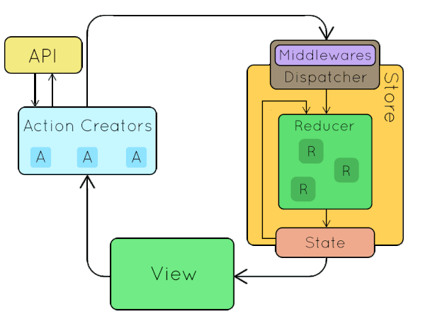

# [Retux](https://github.com/crimx/retux/tree/master/packages/retux)

[](https://www.npmjs.com/package/retux)
[](https://bundlephobia.com/result?p=retux)

[](http://commitizen.github.io/cz-cli/)
[](https://conventionalcommits.org)
[](https://standardjs.com)
[](https://github.com/prettier/prettier)

Minimalist type-safe(strongly-typed) high-performance Redux architecture.

## Installation

- yarn: `yarn add retux`
- npm: `npm add retux`

## Motivation

### Problems of the Redux TypeScript Recipes

Redux officially supports TypeScript typings. But if you read the [recipes](https://redux.js.org/recipes/usage-with-typescript#usage-with-typescript) on the docs it seems even more cumbersome than JavaScript.

You ended up writing something like this:

```typescript
export const SEND_MESSAGE = 'SEND_MESSAGE'
```

And also this:

```typescript
// src/store/system/types.ts
export const UPDATE_SESSION = 'UPDATE_SESSION'

interface UpdateSessionAction {
  type: typeof UPDATE_SESSION
  payload: SystemState
}

export type SystemActionTypes = UpdateSessionAction
```

```typescript
// src/store/system/actions.ts

import { SystemState, UPDATE_SESSION, SystemActionTypes } from './types'

export function updateSession(newSession: SystemState): SystemActionTypes {
  return {
    type: UPDATE_SESSION,
    payload: newSession
  }
}
```

All these boilerplate codes just to get a proper type check.

### Problems of the react-redux-typescript-guide

One of the most popular thrid-party solutions for Redux in TypeScript is the [react-redux-typescript-guide](https://github.com/piotrwitek/react-redux-typescript-guide#redux---typing-patterns).

To some degree it solves the redundance issue, but in the cost of writing unconventional codes.

```typescript
import { StateType, ActionType } from 'typesafe-actions';

declare module 'MyTypes' {
  export type Store = StateType<typeof import('./index').default>;
  export type RootAction = ActionType<typeof import('./root-action').default>;
  export type RootState = StateType<ReturnType<typeof import('./root-reducer').default>>;
}

declare module 'typesafe-actions' {
  interface Types {
    RootAction: ActionType<typeof import('./root-action').default>;
  }
}
```

In [typesafe-actions](https://github.com/piotrwitek/typesafe-actions#action-helpers) with modified `function` properties.

```typescript
switch (action.type) {
    case getType(todos.add):
      return [...state, action.payload];
    ...
```

I am not anit-magic but I think it should be avoided when not necessary as it brings obscutiry to the code.

### Problems of Combine Reducer

As the store scales we are encouraged to split it into different reducers and combine them with `combineReducers`.

And [then](https://redux.js.org/faq/reducers#how-do-i-share-state-between-two-reducers-do-i-have-to-use-combinereducers):

> Many users later want to try to share data between two reducers, but find that `combineReducers` does not allow them to do so. There are several approaches that can be used:

Now you either go down the reducer-hell with `reduce-reducers` or move logic to middlewares. If you move only the necessary logic to middlewares then your codebase will look scattered. Or if for consistency you move most of the logic to middlewares(a.k.a fat middleware) then the reducer is all boilerplate code.

I will explain how to address this with Retux architecture.

### You Don't Need Boilerplate Action Creators

> Action creators are exactly that—functions that create actions. It's easy to conflate the terms “action” and “action creator”, so do your best to use the proper term.
> ...
> This makes them portable and easy to test.

```javascript
function addTodo(text) {
  return {
    type: ADD_TODO,
    text
  }
}
```

Boilerplate action creators are those who do nothing but simply return an action like the example above.

Boilerplate action creators are needed in JavaScript because Redux relies on `string` to distinguish action types. But to JavaScript compiler, `ACTION1` and `ACTION2` are no different, they are all `string`. So if you mistype `ACTION1` as `ACTION2`(and you will, according to Murphy's Law), no compile-time error is yelled. But when the action is wrapped in a function whose name should you mistyped, the compiler/linter can now correctly catch the error.

This is not the case with TypeScript in which we can declare actual `ACTION1` and `ACTION2` types to get TypeScript compile-time errors.

So instead of wasting time in coming up extra names for meaningless wrappers, you can safely get rid of boilerplate action creators(I will explain how below).

## Core Concept of Retux

Before we begin, let's take a look again at the Redux data flow(*source unknown*):



The bubbles that move around(except state) are all actions. It's not hard to tell that the design of Redux is "action centric". So to reduce boilerplate code the design of Retux is all about reusing action types.

Introducing...

### ActionCatalog

```typescript
import { CreateActionCatalog } from 'retux'

type ActionCatalog = CreateActionCatalog<{
  ACTION0: {}
  ACTION1: {
    payload: boolean
  }
  ANOTHER_ACTION: {
    payload: {
      amount: number
    }
    meta: string
  }
}>
```

ActionCatalog defines all the actions of a module. Since it is a basic object type, it can be split and merged which offers great flexibility.

### ActionType

Retux offers `ActionType` for extracting action type names from ActionCatalog. As you can easily figure out, they are just keys of ActionCatalog.

```typescript
import { ActionType } from 'retux'

type ModuleActionTypeNames = ActionType<ActionCatalog>
```

### Action

Here comes the interesting part, how can we extract actions from ActionCatalog?

It is easy to get something like:

```typescript
type Actions = {
  type: 'ACTION1' | 'ACTION2' | ...
  payload: "action1's payload" | "action2's payload" | ...
  meta: "action1's meta" | "action2's meta" | ...
}
```

which is not useful because we want:

```typescript
if (action.type === 'ACTION1') {
  action.payload // -> Will narrow down to ACTION1's payload type
}
```

which means we need:

```typescript
type Actions =
  | {
      type: 'ACTION1'
      payload: "action1's payload"
      meta: "action1's meta"
    }
  | {
      type: 'ACTION2'
      payload: "action2's payload"
      meta: "action2's meta"
    }
  | ...
```

Retux offers `Action` type to deal with just that. It makes use of the "`extend` on union" feature of TypeScript(>= 2.8).

You can choose basic action type `{ type, payload, meta }`

```typescript
import { Action } from 'retux'
// or
import { Action } from 'retux/lib/basic'

type AllActions = Action<ActionCatalog>
type Action1 = Action<ActionCatalog, 'ACTION1'>
```

Or [FSA compliant](https://github.com/redux-utilities/flux-standard-action) action type `{ type, error, payload, meta }`

```typescript
import { FSA } from 'retux'
// or
import { Action } from 'retux/lib/fsa'

type AllActions = Action<ActionCatalog>
type Action1 = Action<ActionCatalog, 'ACTION1'>
```

Note that FSA is also strongly typed. Each action can either be

```javascript
{
  type: // as in ActionCatalog
  error?: false
  payload: // as in ActionCatalog
  meta: // as in ActionCatalog
}
```

or

```javascript
{
  type: // as in ActionCatalog
  error: true
  payload: Error
  meta: // as in ActionCatalog
}
```

### ActionHandlers

The default Redux architecture uses `switch` in reducer which is hard for code splitting. In Retux we use plain `object` instead.

```typescript
const counterActionHandlers: ActionHandlers<
  CounterState,
  CounterActionCatalog
> = {
  INCREMENT: (state, { payload }) => ({
    count: state.count + (payload == null ? 1 : payload)
  }),
  DECREMENT: (state, { payload }) => ({
    count: state.count - (payload == null ? 1 : payload)
  })
}
```

Or with FSA:

```typescript
const counterActionHandlers: ActionHandlers<
  CounterState,
  CounterActionCatalog
> = {
  INCREMENT: (state, action) =>
    action.error
      ? state // error handling
      : {
          count: state.count + (action.payload == null ? 1 : action.payload)
        },
  DECREMENT: (state, action) =>
    action.error
      ? state // error handling
      : {
          count: state.count - (action.payload == null ? 1 : action.payload)
        }
}
```

Notice with FSA we do not destructure the `action` argument so that we can separate action types with and without `error`.

Since `ActionHandlers` is strongly typed, any missing or misspelled action handler will fail TypeScript compiling.

You can also get a single action handler type with `ActionHandler`. I will show how later in the modularization example.

## Basic Tutorial

In this basic tutorial I will explain the Retux concept with a simple single module store.
